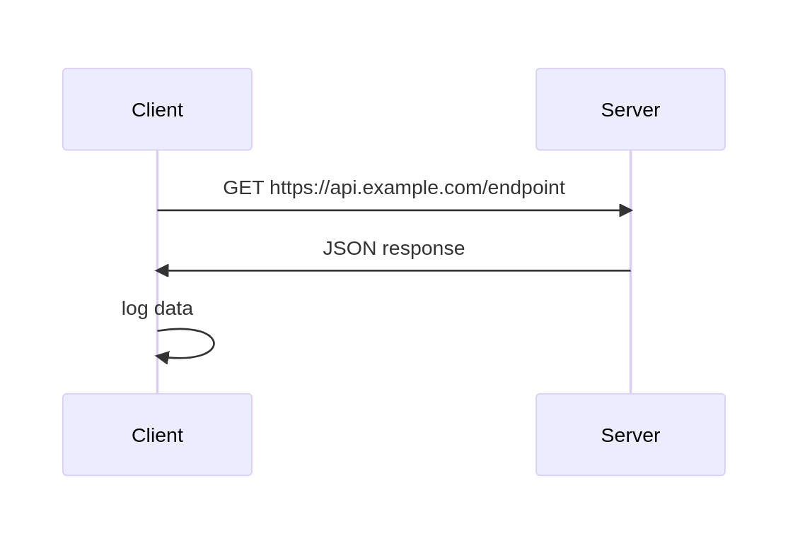

+++
title = "Diagramming with ChatGPT"
date = 2023-01-03

[taxonomies]
tags = ["chatgpt", "fun"]
+++

# Introduction
ChatGPT cannot embed pictures in conversations, but it is still possible to draw diagrams and charts like flowcharts, sequence diagrams, Gantt charts and many others.

There are tools such as `mermaid.js` (or, just Mermaid) that enable this. Quoting the official introduction about Mermaid:
> ... is a JavaScript based diagramming and charting tool that renders Markdown-inspired text definitions to create and modify diagrams dynamically.

So with Mermaid, you just need to __ask ChatGPT to write Mermaid code to draw diagrams__. Then copy the code and paste it in [Mermaid Live Editor](https://mermaid.live/), you'll get the diagram.

# Examples
## Example 1 (Sequence diagram)
Example of making HTTP request in js:
> Q: How do I make an HTTP request in Javascript? Explain with diagram in mermaid.js syntax.

ChatGPT (answer stripped):
To make an HTTP request in JavaScript, you can use the `XMLHttpRequest` (XHR) API:

```md
sequenceDiagram
  participant Client
  participant Server

  Client ->> Server: GET https://api.example.com/endpoint
  Server ->> Client: JSON response
```

<br>

Alternatively, you can use the `fetch()` function, which is part of the modern Fetch API, to make HTTP requests:

```md
sequenceDiagram
  participant Client
  participant Server

  Client ->> Server: GET https://api.example.com/endpoint
  Server ->> Client: JSON response
  Client ->> Client: log data
```


### Output
Sequence diagram of first case which uses XHR:


Sequence diagram of second case which uses the `fetch()` call:




## Example 2 (State diagram)
Example of a state machine that represents a light switch with two states: "on" and "off":

```md
stateDiagram
  state on
  state off

  on --> off : flip switch
  off --> on : flip switch
  on --> off : power outage
```
### Output


# Conclusion
These are just some examples of making diagrams with ChatGPT (and Mermaid). You can leverage their combination to learn about something, with diagrams. Or you may also want to create diagrams for...your report!

If you want to learn about the capabilities of Mermaid, visit: https://mermaid.js.org/.
