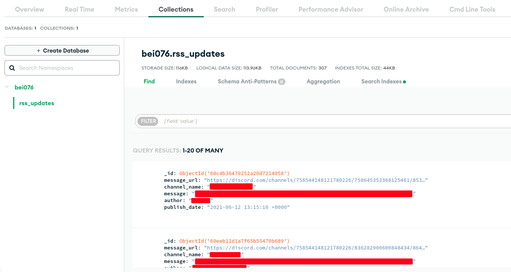
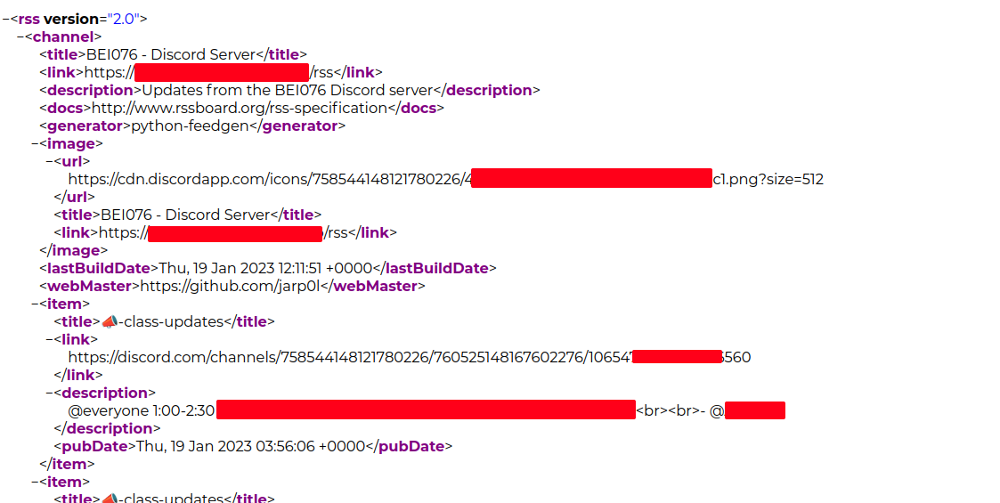
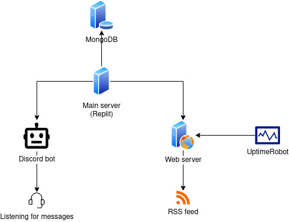

+++
title = "Reading Discord messages with RSS feed reader"
date = 2023-01-19

[taxonomies]
tags = ["rss", "fun"]
+++

TL;DR I had a bot listening to messages in Discord. If there were any messages, it would store them in a MongoDB collection and then the messages would be fetched to make an RSS feed.

# The problem
This was over a year ago when we had something called 'Lockdown', I wanted to stay away from Discord for the peace of my mind but as our class server in Discord was the only way to remain informed of any class updates, I was having a hard time doing that. I wanted something that was simpler, less/not distracting and with no tracking.

# The idea
Around the same time I had discovered about the existence of RSS, which I thought was the ideal solution for these problems.

I already had a bot running in our Discord server. So I decided I would implement my idea using this bot. The bot was written in Python and was running in Replit, so I just had to add the logic to listen to messages in my channel/s of choice. If there was a new message, it had to store them in MongoDB first. Then all that was left to do was to retrieve those messages from the database and structure them into XML file following the RSS 2.0 specification so that RSS readers could parse them.

# About RSS
First, definition from [Wikipedia entry on RSS](https://en.wikipedia.org/wiki/RSS):
> RSS (RDF Site Summary or Really Simple Syndication) is a web feed that allows users and applications to access updates to websites in a standardized, computer-readable format.

RSS provides a way of viewing contents at a place aggregated from multiple sources. The sources could be news, blog posts, release notes about something, changelogs, and what not. Rather than having to go to each source and check if anything new has been added, RSS enables the power of viewing the updates from a single place.

The updates are served in a file which is called RSS feed. The RSS feed is just an extension from XML, and follows [RSS 2.0 specification](https://www.rssboard.org/rss-specification), which is the current version of the specification.

To view the RSS feeds, there are clients which are called RSS feed readers. The RSS feed readers parse the RSS feeds to give a pretty-looking interface for viewing the updates. There are all forms of RSS feed readers, from web-based readers to mobile apps to browser extensions.

This blog also has an RSS feed: [/rss.xml](/rss.xml)


# Getting into work
Before going to the actual RSS feed part, I will explain in short the structure and working of some less important parts of the codebase first (less important in terms of what this post is for).

## Structure
The application is structured in the following way:
```
.
| cogs
	|- admin.py
	|- clean_url.py
	|- feed.py
	|- misc.py
	|- ping.py
	|- xkcd_comics.py
| config
	|- config.json
	|- strings.json
| feed
	|- rss.xml
| libs
	|- config.py
	|- my_feed.py
|- keep_alive.py
|- main.py
|- poetry.lock
|- pyproject.toml
|- README.md
```

The entry point to the application is the `main.py` file. This file consists of mostly code for the Discord bot. However, it also calls the `keep_alive()` function from `keep_alive.py` file, which does two key things:
1. running web server
2. scheduling and running the task of updating RSS feed

I am using `poetry` to manage dependencies and virtual environment.


### `keep_alive.py` file
As I mentioned earlier, this file runs web server as well as schedules the task of updating the RSS feed.

The web server is used to keep the bot running as Replit puts an application (or Repl) to sleep if it is inactive for some time. I keep the bot alive by pinging the root (`/`) every few minutes using [UptimeRobot](https://uptimerobot.com/).

The web server also serves the RSS file (XML file) containing Discord messages. The RSS file is kept in the `feed` drectory (`feed/rss.xml`). So, an RSS feed reader should subscribe to either `/rss` or `/feed/rss.xml` path of the web server for RSS feed.

```py
@app.route("/rss")
# another route: /feed/rss.xml
def feed():
    with open("feed/rss.xml") as f:
        xml = f.readlines()
    r = Response(response=xml, status=200, mimetype="application/xml")
    r.headers["Content-Type"] = "text/xml; charset=utf-8"
    return r
```

This file also schedules the task of updating the RSS feed, which happens every 30 minutes:
```py
from apscheduler.schedulers.background import BackgroundScheduler
from libs.my_feed import MyFeed
# ...
scheduler = BackgroundScheduler()
scheduler.add_job(MyFeed().update_feed, "interval", minutes=30)
scheduler.start()
```

The feed updating happens once when the web server starts and also every 30 minutes.


### `main.py` file
As I stated earlier, this is the entry point to the application. It contains logic to run the bot. To make the bot modular, the commands have been divided into cogs. But we are only concerned with the `feed` cog (`cogs/feed.py`). This cog listens to messages in certain channels in Discord and stores them in a MongoDB collection.

### The `feed` cog
This cog consists of the code which handles listening to messages in specific channels which are listed in the array `listen_channels` in `config/config.json` file. So, if someone posts a new message in one of those channels and it isn't from the bot itself, then this message is added to the MongoDB collection.
```py
        if ctx.channel.id in c_listen_channels:
            MyFeed().add_feed(ctx, ctx.attachments)
```


## Adding to/updating RSS feed
### `feedgen` library
For the ease of creating RSS feed, I used a Python library called `feedgen` ([link](https://feedgen.kiesow.be/)). It made this process a lot easier as I did not have to deal with XML myself.

In the `libs/my_feed.py` file, the class `MyFeed` extends the `FeedGenerator` class from `feedgen`. Its constuctor initializes the MongoDB client along with preparing information like feed title, subtitle, logo, etc.


### MongoDB URI
The MongoDB URI (or connection string URI) is kept as an environment variable with key `MONGODB_URI`. The URI has the following format:
```
mongodb://[username:password@]host1[:port1][,...hostN[:portN]][/[defaultauthdb][?options]]
```
The URI in this format consists of all the necessary fields like username, password, host and DB name. Refer to the official docs for detailed explanation: https://www.mongodb.com/docs/manual/reference/connection-string/


### Adding a new message to feed
If the bot detects any message in Discord, the `add_feed` method of `MyFeed` class is called with the arguments message context and attachment (if any). A feed dictionary is constructed with the following values:
- `message_url`: message url in Discord
- `channel_name`: name of channel where the message was posted
- `message`: the message posted
- `author`: the name of author of the message
- `publish_date`: The date, time and timezone in UTC+0 of the moment of adding the feed

```py
new_update = {
            "message_url": f"https://discord.com/channels/758544148121780226/{channel_id}/{message_id}",
            "channel_name": channel_name,
            "message": message,
            "author": author,
            "publish_date": str_date,
        }
```

I did not directly generate the RSS feed. First I inserted the dictionary into a MongoDB collection and then called the `update_feed` method to generate the feed.

Inserting a new document into MongoDB collection:
```py
from pymongo import MongoClient
# ...
s_mongodb = os.environ["MONGODB_URI"]
# ...
self.mongo_client = MongoClient(s_mongodb, tls=True)
self.server_db = self.mongo_client[os.environ["mongodb_name"]]
self.updates = self.server_db[os.environ["collection_name"]]
# ...

# in add_feed(...):
self.updates.insert_one(new_update)
```

Data in MongoDB:


### Updating feed
The RSS feed is updated by calling the `update_feed` method of the `MyFeed` class. This method iterates through all the documents in the MongoDB collection and then prepares the RSS feed file. It uses `find()` function to get all the documents in the collection.
```py
    def update_feed(self):
        for entry in self.updates.find():
			fe = self.add_entry()
			# get message, message channel, author, date-time from db
            self.rss_str(pretty=True)  # Get the RSS feed as string
            self.rss_file("feed/rss.xml")  # Write the RSS feed to a file
```

Generated RSS feed:



### Publish date-time
I was using the `datetime` and `zoneinfo` for the date, time and timezone, but I have moved to using [`pendulum`](https://pendulum.eustace.io/) now.

Code snippet to get string representation of the date-time of the moment a Discord message is being added to database:
```py
        publish_date = pendulum.now(tz="UTC")
        str_date = publish_date.format("YYYY-MM-DD HH:mm:ss ZZ")
```

Code snippet for converting date-time from MongoDB document:
```py
            fe.published(
                pendulum.from_format(
                    entry["publish_date"], "YYYY-MM-DD HH:mm:ss ZZ", tz="UTC"
                )
            ) 
```


# Finally...
I have put together a diagram to show the core working process of this system:


The code for this is in GitHub at: [jarp0l/076bei-bot](https://github.com/jarp0l/076bei-bot)

Disclaimer: I recently updated some stuffs in the code, but have not tested if the new changes work as expected. Also, the code is untested for bugs and exceptions as it was written quite a long time ago. As the bot was written before slash commands were adopted, it doesn't support them.
